# Klinik Sehat Utama — Klinik Digital (Booking Konsultasi Dokter)


> Klinik Sehat Utama adalah aplikasi mobile booking konsultasi dokter untuk pasien klinik. Pasien dapat mendaftar/login, memilih dokter spesialis sesuai jadwal praktik, melihat riwayat konsultasi, serta mengelola profil termasuk verifikasi identitas dengan foto KTP. Aplikasi dibangun dengan React Native + Expo dan sudah di-build menjadi APK Android melalui EAS Build.

---

## 📸 Screenshots

| Login | Daftar Akun | Home — Pilih Dokter | Tanggal Konsultasi |
| :---: | :---: | :---: | :---: |
| 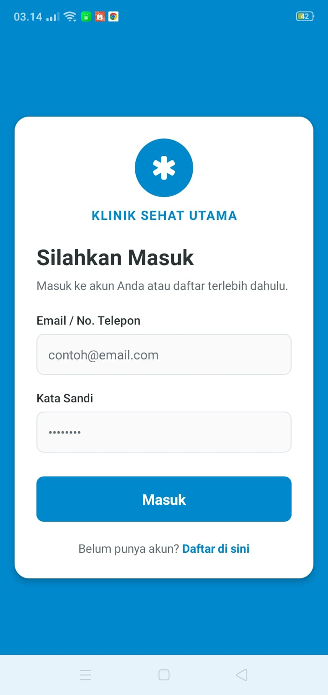 | 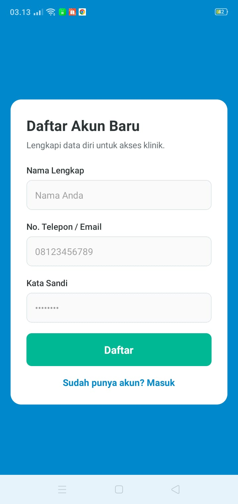 | 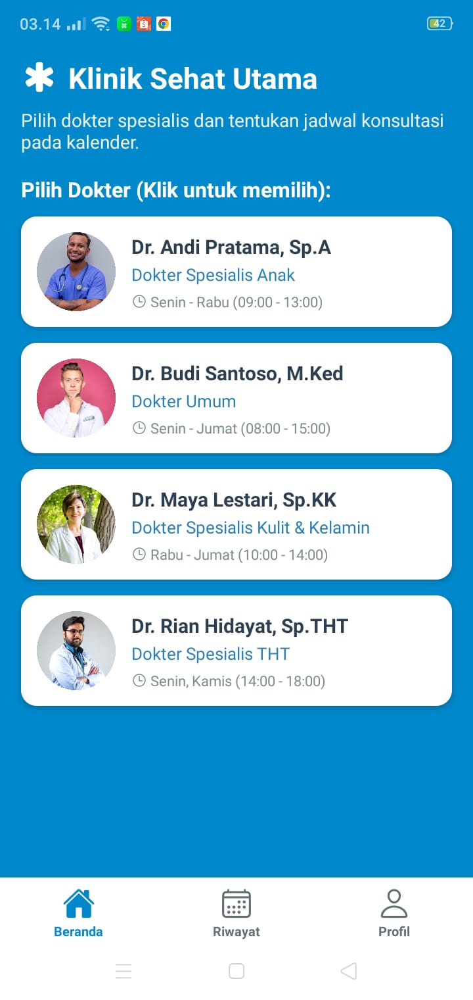 | 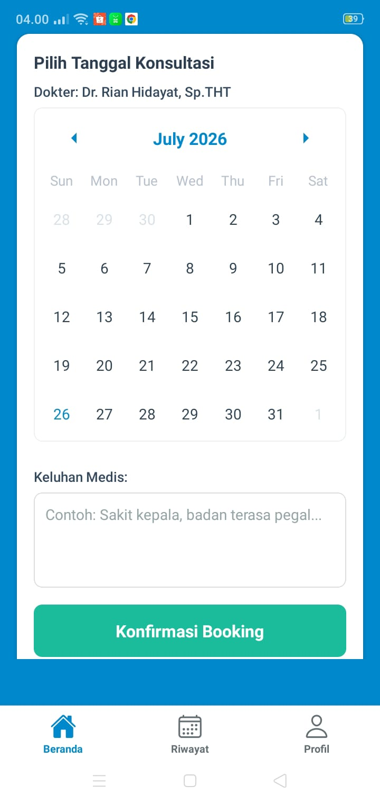 |

| Riwayat Konsultasi | Profil Pasien | Izin Akses Kamera | Ikon Aplikasi |
| :---: | :---: | :---: | :---: |
| 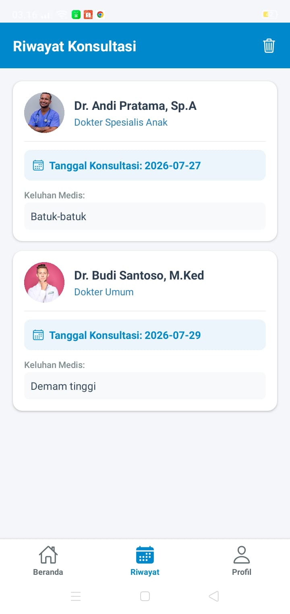 | 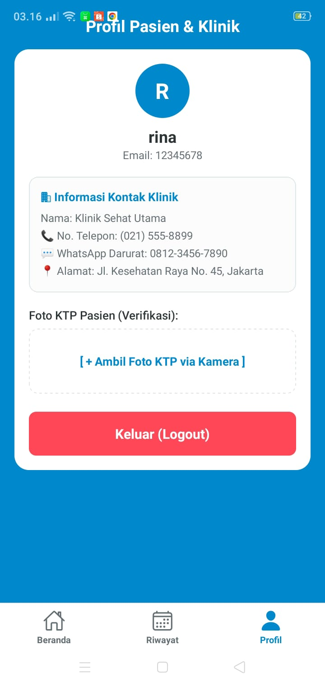 | 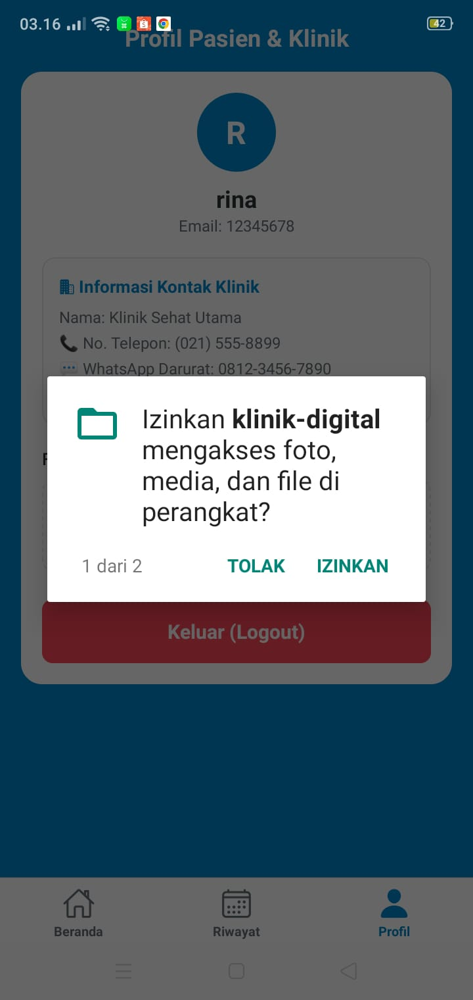 | 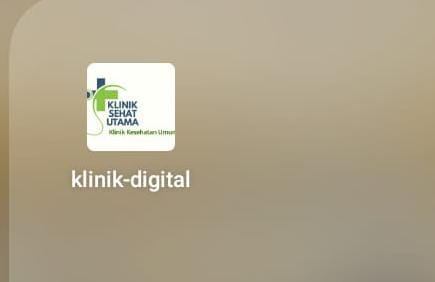 |

| Konfirmasi APK | Build Detail EAS | QR Install |
| :---: | :---: | :---: |
| 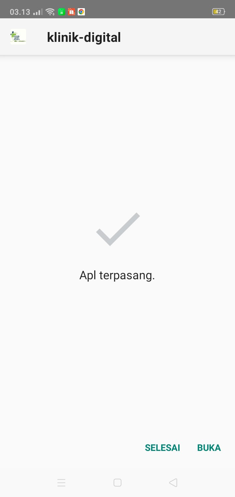 | 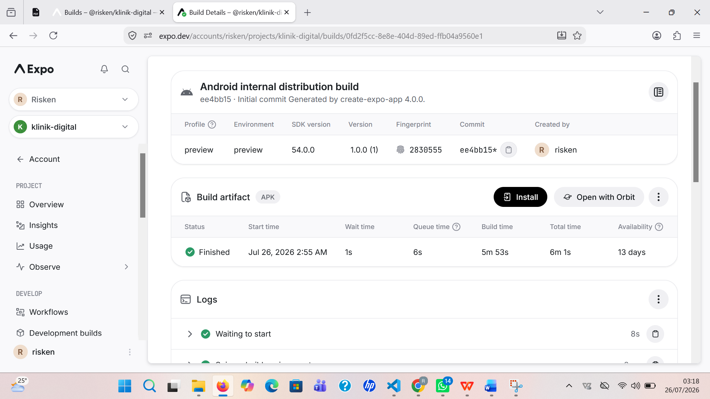 | 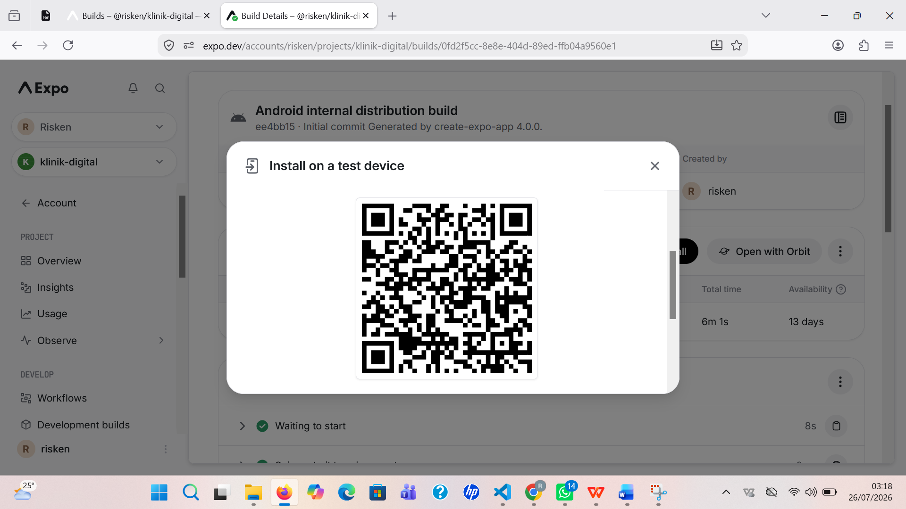 |
---

## ✨ Fitur Utama (sesuai screenshot)

- [x] **Login/Masuk** — form Email/No. Telepon & Kata Sandi dengan validasi (`login.png`)
- [x] **Daftar Akun Baru** — registrasi pasien: Nama Lengkap, No. Telepon/Email, Kata Sandi (`register.png`)
- [x] **Home — Pilih Dokter Spesialis** — daftar dokter (Anak, Umum, Kulit & Kelamin, THT) beserta jadwal praktik, ditampilkan dengan FlatList (`home.png`)
- [x]  **Tanggal konsultasi dokter** - tanggal/hari konsultasi pasien (`tanggal.png`)
- [x] **Riwayat Konsultasi** — histori booking pasien lengkap dengan nama dokter, spesialisasi, tanggal konsultasi, dan keluhan medis, serta opsi hapus riwayat (`riwayat-konsultasi.jpeg`)
- [x] **Profil Pasien & Klinik** — info akun pasien, kontak klinik (telepon, WhatsApp darurat, alamat), dan upload **Foto KTP via Kamera** untuk verifikasi identitas (`profil.png`)
- [x] **Izin Akses Kamera/Media** — permintaan permission Android untuk mengakses foto, media, dan file saat mengambil foto KTP (`akses.png`)
- [x] **Bottom Tab Navigation** — 3 tab utama: Beranda, Riwayat, Profil
- [x] **Build & Distribusi APK** — build Android internal distribution via EAS Build, dapat diinstal langsung lewat QR Code (`eas.png`, `qr.png`, `apl-terpasang.jpeg`, `icon.png`)

---

## 🛠️ Tech Stack

| Layer | Teknologi |
|-------|-----------|
| Framework | React Native + Expo (SDK 54) |
| Navigation | React Navigation v6 (Stack + Bottom Tab) |
| Storage | @react-native-async-storage/async-storage |
| Device | expo-image-picker (foto KTP via kamera) |
| Build | EAS Build (Expo Application Services) — profile: `preview`, Android APK |

---

## 🚀 Cara Menjalankan

```bash
git clone https://github.com/riskensitorus/UAS-RISKEN-SIORUS.git
cd klinik-digital
npm install
npx expo start
```
Scan QR Code dengan Expo Go di HP.

---

## 📦 Download APK

[Download APK terbaru](https://expo.dev/accounts/risken/projects/klinik-digital/builds/0fd2f5cc-8e8e-404d-89ed-ffb04a9560e1)

Atau install langsung dari build Expo (scan QR di halaman *Install on a test device*):


---

## 🌐 Expo Snack

[Buka di Expo Snack](https://snack.expo.dev/@risken192/uas-risken-sitorus)

---

## 👤 Developer

**RISKEN SITORUS** | 243303621292| 4PAGIB
Universitas Prima Indonesia — Prodi Sistem Informasi
Mata Kuliah: Pemrograman Mobile (TI-MOBILE-01)
